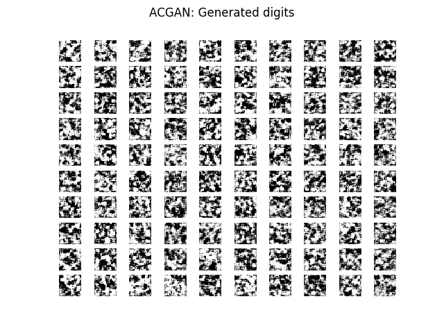
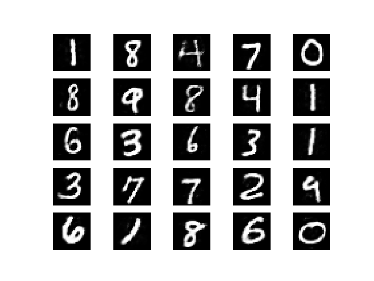
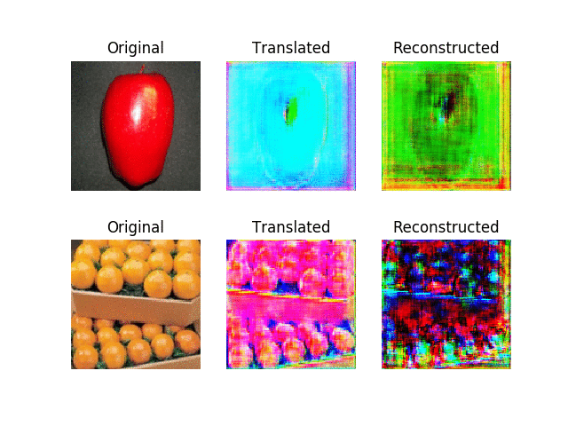
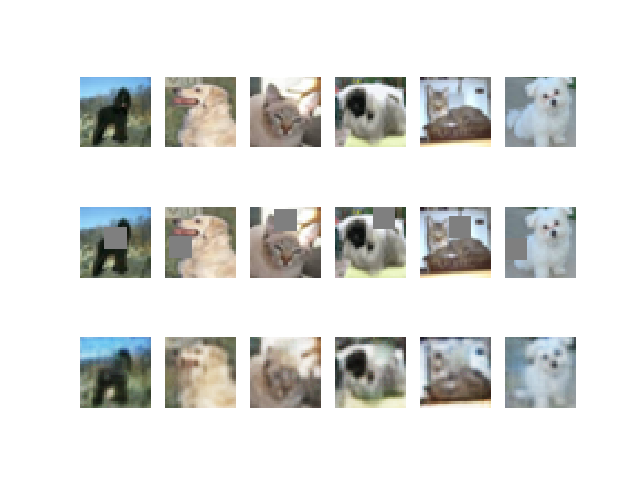
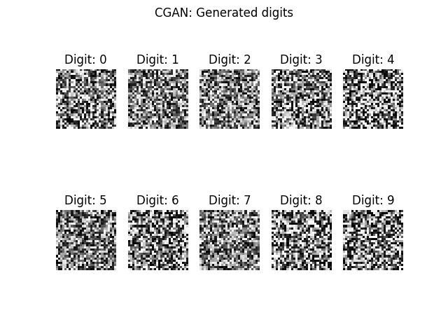
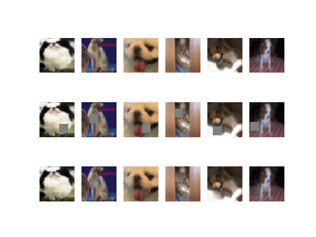

## Keras-GAN
Collection of Keras implementations of Generative Adversarial Networks (GANs) suggested in research papers. These models are in some cases simplified versions of the ones ultimately described in the papers, but I have chosen to focus on getting the core ideas covered instead of getting every layer configuration right.

## Table of Contents
  * [Installation](#installation)
  * [Implementations](#implementations)
    + [Auxiliary Classifier GAN](#ac-gan)
    + [Adversarial Autoencoder](#adversarial-autoencoder)
    + [Bidirectional GAN](#bigan)
    + [Boundary-Seeking GAN](#bgan)
    + [Conditional GAN](#cgan)
    + [Context-Conditional GAN](#cc-gan)
    + [Context Encoder](#context-encoder)
    + [Coupled GANs](#cogan)
    + [CycleGAN](#cyclegan)

## Installation
    $ git clone https://github.com/cpt-r3tr0/GAN-Keras.git
    $ cd GAN-Keras/
    $ sudo pip3 install -r requirements.txt

## Implementations 
  
### AC-GAN
Implementation of _Auxiliary Classifier Generative Adversarial Network_.

[Code](implementations/acgan/acgan.py)

Paper: https://arxiv.org/abs/1610.09585

#### Example
```
$ cd implementations/acgan/
$ python3 acgan.py
```

<p align="center">
    
</p>

### Adversarial Autoencoder
Implementation of _Adversarial Autoencoder_.

[Code](implementations/aae/aae.py)

Paper: https://arxiv.org/abs/1511.05644

#### Example
```
$ cd implementations/aae/
$ python3 aae.py
```

<p align="center">
    
</p>

### BiGAN
Implementation of _Bidirectional Generative Adversarial Network_.

[Code](implementations/bigan/bigan.py)

Paper: https://arxiv.org/abs/1605.09782

#### Example
```
$ cd implementations/bigan/
$ python3 bigan.py
```

### BGAN
Implementation of _Boundary-Seeking Generative Adversarial Networks_.

[Code](implementations/bgan/bgan.py)

Paper: https://arxiv.org/abs/1702.08431

#### Example
```
$ cd implementations/bgan/
$ python3 bgan.py
```


### CycleGAN
Implementation of _Unpaired Image-to-Image Translation using Cycle-Consistent Adversarial Networks_.

[Code](cyclegan/cyclegan.py)

Paper: https://arxiv.org/abs/1703.10593

<p align="center">
    
</p>

#### Example
```
$ cd cyclegan/
$ bash download_dataset.sh apple2orange
$ python3 cyclegan.py
```   

<p align="center">
    
</p>

### CC-GAN
Implementation of _Semi-Supervised Learning with Context-Conditional Generative Adversarial Networks_.

[Code](ccgan/ccgan.py)

Paper: https://arxiv.org/abs/1611.06430

#### Example
```
$ cd ccgan/
$ python3 ccgan.py
```

<p align="center">
    
</p>

### CGAN
Implementation of _Conditional Generative Adversarial Nets_.

[Code](cgan/cgan.py)

Paper:https://arxiv.org/abs/1411.1784

#### Example
```
$ cd cgan/
$ python3 cgan.py
```

<p align="center">
    
</p>

### Context Encoder
Implementation of _Context Encoders: Feature Learning by Inpainting_.

[Code](context_encoder/context_encoder.py)

Paper: https://arxiv.org/abs/1604.07379

#### Example
```
$ cd context_encoder/
$ python3 context_encoder.py
```

<p align="center">
    
</p>

### CoGAN
Implementation of _Coupled generative adversarial networks_.

[Code](cogan/cogan.py)

Paper: https://arxiv.org/abs/1606.07536

#### Example
```
$ cd cogan/
$ python3 cogan.py
```
