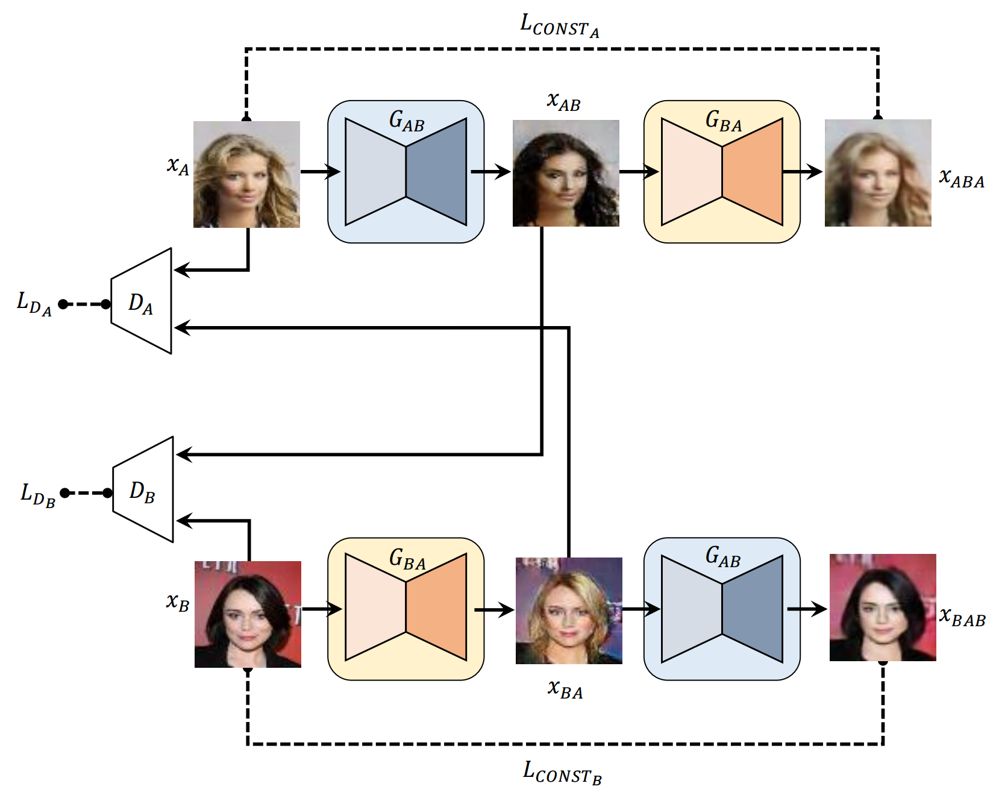

## Keras-GAN
Collection of Keras implementations of Generative Adversarial Networks (GANs) suggested in research papers. These models are in some cases simplified versions of the ones ultimately described in the papers, but I have chosen to focus on getting the core ideas covered instead of getting every layer configuration right.

## Table of Contents
  * [Installation](#installation)
  * [Implementations](#implementations)
    + [Auxiliary Classifier GAN](#ac-gan)
    + [Adversarial Autoencoder](#adversarial-autoencoder)
    + [Bidirectional GAN](#bigan)
    + [Boundary-Seeking GAN](#bgan)
    + [Conditional GAN](#cgan)
    + [Context-Conditional GAN](#cc-gan)
    + [Context Encoder](#context-encoder)
    + [Coupled GANs](#cogan)
    + [CycleGAN](#cyclegan)
    + [Deep Convolutional GAN](#dcgan)
    + [DiscoGAN](#discogan)
    + [DualGAN](#dualgan)
    + [Generative Adversarial Network](#gan)
    + [InfoGAN](#infogan)
    + [LSGAN](#lsgan)
    + [Pix2Pix](#pix2pix)
    + [PixelDA](#pixelda)
    + [Semi-Supervised GAN](#sgan)
    + [Super-Resolution GAN](#srgan)
    + [Wasserstein GAN](#wgan)
    + [Wasserstein GAN GP](#wgan-gp)  

## Installation
    $ git clone https://github.com/cpt-r3tr0/GAN-Keras.git
    $ cd GAN-Keras/
    $ sudo pip3 install -r requirements.txt

## Implementations 
  
### AC-GAN
Implementation of _Auxiliary Classifier Generative Adversarial Network_.

[Code](implementations/acgan/acgan.py)

Paper: https://arxiv.org/abs/1610.09585

#### Example
```
$ cd implementations/acgan/
$ python3 acgan.py
```

<p align="center">
    
</p>

### Adversarial Autoencoder
Implementation of _Adversarial Autoencoder_.

[Code](implementations/aae/aae.py)

Paper: https://arxiv.org/abs/1511.05644

#### Example
```
$ cd implementations/aae/
$ python3 aae.py
```

<p align="center">
    
</p>

### BiGAN
Implementation of _Bidirectional Generative Adversarial Network_.

[Code](implementations/bigan/bigan.py)

Paper: https://arxiv.org/abs/1605.09782

#### Example
```
$ cd implementations/bigan/
$ python3 bigan.py
```

### BGAN
Implementation of _Boundary-Seeking Generative Adversarial Networks_.

[Code](implementations/bgan/bgan.py)

Paper: https://arxiv.org/abs/1702.08431

#### Example
```
$ cd implementations/bgan/
$ python3 bgan.py
```


### CycleGAN
Implementation of _Unpaired Image-to-Image Translation using Cycle-Consistent Adversarial Networks_.

[Code](implementations/cyclegan/cyclegan.py)

Paper: https://arxiv.org/abs/1703.10593

<p align="center">
    
</p>

#### Example
```
$ cd implementations/cyclegan/
$ bash download_dataset.sh apple2orange
$ python3 cyclegan.py
```   

<p align="center">
    
</p>

### CC-GAN
Implementation of _Semi-Supervised Learning with Context-Conditional Generative Adversarial Networks_.

[Code](implementations/ccgan/ccgan.py)

Paper: https://arxiv.org/abs/1611.06430

#### Example
```
$ cd ccgan/
$ python3 ccgan.py
```

<p align="center">
    
</p>

### CGAN
Implementation of _Conditional Generative Adversarial Nets_.

[Code](implementations/cgan/cgan.py)

Paper:https://arxiv.org/abs/1411.1784

#### Example
```
$ cd implementations/cgan/
$ python3 cgan.py
```

<p align="center">
    
</p>

### Context Encoder
Implementation of _Context Encoders: Feature Learning by Inpainting_.

[Code](implementations/context_encoder/context_encoder.py)

Paper: https://arxiv.org/abs/1604.07379

#### Example
```
$ cd implementations/context_encoder/
$ python3 context_encoder.py
```

<p align="center">
    
</p>

### CoGAN
Implementation of _Coupled generative adversarial networks_.

[Code](implementations/cogan/cogan.py)

Paper: https://arxiv.org/abs/1606.07536

#### Example
```
$ cd implementations/cogan/
$ python3 cogan.py
```

### DCGAN
Implementation of _Deep Convolutional Generative Adversarial Network_.

[Code](implementations/dcgan/dcgan.py)

Paper: https://arxiv.org/abs/1511.06434

#### Example
```
$ cd implementations/dcgan/
$ python3 dcgan.py
```

<p align="center">
    
</p>

### DiscoGAN
Implementation of _Learning to Discover Cross-Domain Relations with Generative Adversarial Networks_.

[Code](implementations/discogan/discogan.py)

Paper: https://arxiv.org/abs/1703.05192

<p align="center">
    
</p>

#### Example
```
$ cd implementations/discogan/
$ bash download_dataset.sh edges2shoes
$ python3 discogan.py
```   

<p align="center">
    
</p>

### DualGAN
Implementation of _DualGAN: Unsupervised Dual Learning for Image-to-Image Translation_.

[Code](implementations/dualgan/dualgan.py)

Paper: https://arxiv.org/abs/1704.02510

#### Example
```
$ cd implementations/dualgan/
$ python3 dualgan.py
```

### GAN
Implementation of _Generative Adversarial Network_ with a MLP generator and discriminator.

[Code](implementations/gan/gan.py)

Paper: https://arxiv.org/abs/1406.2661

#### Example
```
$ cd implementations/gan/
$ python3 gan.py
```

<p align="center">
    
</p>

### InfoGAN
Implementation of _InfoGAN: Interpretable Representation Learning by Information Maximizing Generative Adversarial Nets_.

[Code](implementations/infogan/infogan.py)

Paper: https://arxiv.org/abs/1606.03657

#### Example
```
$ cd implementations/infogan/
$ python3 infogan.py
```

<p align="center">
    
</p>

### LSGAN
Implementation of _Least Squares Generative Adversarial Networks_.

[Code](implementations/lsgan/lsgan.py)

Paper: https://arxiv.org/abs/1611.04076

#### Example
```
$ cd implementations/lsgan/
$ python3 lsgan.py
```
### Pix2Pix
Implementation of _Image-to-Image Translation with Conditional Adversarial Networks_.

[Code](implementations/pix2pix/pix2pix.py)

Paper: https://arxiv.org/abs/1611.07004

<p align="center">
    
</p>

#### Example
```
$ cd implementations/pix2pix/
$ bash download_dataset.sh facades
$ python3 pix2pix.py
```   

<p align="center">
    
</p>

### PixelDA
Implementation of _Unsupervised Pixel-Level Domain Adaptation with Generative Adversarial Networks_.

[Code](implementations/pixelda/pixelda.py)

Paper: https://arxiv.org/abs/1612.05424

#### MNIST to MNIST-M Classification
Trains a classifier on MNIST images that are translated to resemble MNIST-M (by performing unsupervised image-to-image domain adaptation). This model is compared to the naive solution of training a classifier on MNIST and evaluating it on MNIST-M. The naive model manages a 55% classification accuracy on MNIST-M while the one trained during domain adaptation gets a 95% classification accuracy.

```
$ cd implementations/pixelda/
$ python3 pixelda.py
```

| Method       | Accuracy  |
| ------------ |:---------:|
| Naive        | 55%       |
| PixelDA      | 95%       |

### SGAN
Implementation of _Semi-Supervised Generative Adversarial Network_.

[Code](implementations/sgan/sgan.py)

Paper: https://arxiv.org/abs/1606.01583

#### Example
```
$ cd implementations/sgan/
$ python3 sgan.py
```

<p align="center">
    
</p>

### SRGAN
Implementation of _Photo-Realistic Single Image Super-Resolution Using a Generative Adversarial Network_.

[Code](implementations/srgan/srgan.py)

Paper: https://arxiv.org/abs/1609.04802

<p align="center">
    
</p>


#### Example
```
$ cd implementations/srgan/
<follow steps at the top of srgan.py>
$ python3 srgan.py
```

<p align="center">
    
</p>

### WGAN
Implementation of _Wasserstein GAN_ (with DCGAN generator and discriminator).

[Code](implementations/wgan/wgan.py)

Paper: https://arxiv.org/abs/1701.07875

#### Example
```
$ cd implementations/wgan/
$ python3 wgan.py
```

<p align="center">
    
</p>

### WGAN GP
Implementation of _Improved Training of Wasserstein GANs_.

[Code](implementations/wgan_gp/wgan_gp.py)

Paper: https://arxiv.org/abs/1704.00028

#### Example
```
$ cd implementations/wgan_gp/
$ python3 wgan_gp.py
```

<p align="center">
    
</p>
